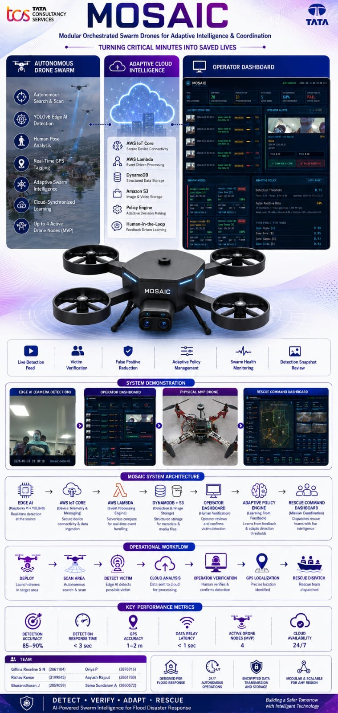

<!-- ═══════════════════════ ANIMATED HERO HEADER ═══════════════════════ -->
<div align="center">

<a href="https://youtu.be/-SGyDQs7yAI">
  
</a>

<!-- TYPING ANIMATION -->
<a href="https://github.com/aayushraj05/Mosaic">
  
</a>

<br/>

<!-- ANIMATED TECH BADGES -->
<p align="center">
  
  
  
  
</p>

<p align="center">
  
  
  
</p>

<!-- LIVE COUNTERS -->
<p align="center">
  
</p>

</div>

<!-- ANIMATED DIVIDER -->


<div align="center">

> ### 🌊 *"Turning Critical Minutes into Saved Lives"*
> **From detection to rescue coordination — in real time**

</div>


<br/>

<!-- ═══════════════════════ SYSTEM OVERVIEW ═══════════════════════ -->

<div align="center">

## 🖼️ System Overview


</div>

---

### 📋 Product Flyer
> 🟦 *Official MOSAIC product flyer showcasing the complete system — autonomous drone swarm, cloud intelligence layer, and dual dashboard architecture designed for flood disaster response.*

<div align="center">
  
</div>

---

### 🛸 Physical MVP Drone
> 🟩 *The actual MOSAIC MVP hardware — F450 quadcopter frame with Avionics C2826 1000KV brushless motors, Raspberry Pi 4 compute unit, and OV5647 camera module running YOLOv8 detection in real time.*

<div align="center">
  
</div>

---

### 📐 MVP CAD Design
> 🟪 *CAD schematic of the MOSAIC MVP drone — showing component placement, frame structure, motor positions, and electronic layout planned before physical assembly.*

<div align="center">
  
</div>

---

### 🎯 Product Design Vision
> 🟧 *Conceptual product-level drone design — the full MOSAIC product vision with custom carbon fiber frame, dual RGB and thermal camera gimbal, active cooling, environmental sensors, and LoRa communication module.*

<div align="center">
  
</div>

---

### 🔍 Live Detection — Drone POV
> 🟥 *Real-time YOLOv8 detection output from drone camera — green bounding box identifies confirmed victim, confidence score 0.87, pose indicators showing arms raised and upright, status CONFIRMED with motors spinning.*

<div align="center">
  
</div>

---

### 📊 Operator Dashboard
> 🟦 *MOSAIC operator dashboard showing live detection feed with victim images, confidence scores, YOLO and pose analysis, adaptive policy threshold, swarm node health, and operator confirm/reject controls for human-in-the-loop learning.*

<div align="center">
  
</div>

---

### 👥 Rescue Team Stakeholder Dashboard
> 🟩 *MOSAIC stakeholder dashboard for NDRF/SDRF commanders — shows confirmed victim count, GPS coordinates, zone coverage map, priority rescue list, and one-tap Google Maps navigation. No technical jargon, only actionable intelligence.*

<div align="center">
  
</div>

---

### 📈 Detection Results
> 🟨 *End-to-end detection pipeline results — showing confirmed and uncertain detections across all 4 swarm nodes, adaptive threshold evolution, operator feedback loop in action, and system accuracy metrics.*

<div align="center">
  
</div>

<br/>


<!-- ═══════════════════════ DEMO VIDEO ═══════════════════════ -->

<div align="center">

## 🎬 Demo Video

[](https://youtu.be/-SGyDQs7yAI)

<a href="https://youtu.be/-SGyDQs7yAI">
  
</a>
<a href="https://drive.google.com/drive/folders/1bEV4gVOkEiWBHRMurLpmcDrqar1YKICs?usp=drive_link">
  
</a>

<br/><br/>

*Live YOLOv8 detection · Motors spinning · Dashboard updating in real time · Operator feedback · Threshold adapting*

</div>


<!-- ═══════════════════════ THE PROBLEM ═══════════════════════ -->

## 🌊 The Problem

<table>
<tr>
<td width="60%">

Every year floods in India displace **40 million people** and claim **1,600+ lives** — not because rescue teams are slow, but because **nobody knows where victims are.**

Manual search teams cover **0.2 sq km/hour**.  
MOSAIC covers **2.4 sq km/hour per drone**.

That is **12× faster.**  
Every second saved is a life saved.

</td>
<td width="40%" align="center">


<br/>

<br/>


</td>
</tr>
</table>

---

## ✨ What MOSAIC Does

| | Capability | Detail |
|:--:|:--|:--|
| 🎯 | **Autonomous Detection** | YOLOv8 detects persons at 15 FPS on edge hardware |
| 🦾 | **Pose Analysis** | 17 body keypoints identify fallen, waving, unconscious victims |
| ☁️ | **Cloud Pipeline** | GPS coordinates reach rescue teams in under 3 seconds |
| 🧠 | **Adaptive Learning** | Operator feedback updates all drones simultaneously |
| 📊 | **Dual Dashboards** | Separate views for technical operators and field commanders |
| 📡 | **Resilient Comms** | Works offline — zero data loss architecture |

---

## 🏗️ System Architecture

```
┌─────────────────────────────────────────────────────────────────┐
│                    EDGE LAYER (Raspberry Pi 4)                  │
│  Camera → YOLOv8 → Pose Analysis → Confidence Score → Decision │
│  CONFIRMED ≥0.60 | UNCERTAIN 0.30-0.60 | MISSED <0.30         │
└─────────────────────┬───────────────────────────────────────────┘
                      │ MQTT over TLS 1.2
                      ▼
┌─────────────────────────────────────────────────────────────────┐
│                  CLOUD LAYER (AWS ap-south-1)                   │
│  IoT Core → Lambda ×7 → DynamoDB → S3 → API Gateway           │
└─────────────────────┬───────────────────────────────────────────┘
                      │ REST API HTTPS
                      ▼
┌─────────────────────────────────────────────────────────────────┐
│                    COMMAND LAYER (Dashboards)                   │
│  Operator Dashboard ← Same API → Stakeholder Dashboard         │
│  (Technical review)              (GPS + Priority + Maps)       │
└─────────────────────────────────────────────────────────────────┘
```

---

## ⚡ Key Performance Metrics

<div align="center">

| Metric | MVP Value | Product Target |
|--------|-----------|----------------|
| Detection Speed | **0.07 sec/frame** | 0.03 sec/frame |
| Detection Accuracy | **85–90%** | 91–95% |
| GPS Precision | Configurable | 1–2 meters |
| Data Latency | **< 3 seconds** | < 1 second |
| Drones per Operator | **4** | 16 |
| Area per Charge | **2.4 sq km** | 4.8 sq km |
| vs Manual Search | **12× faster** | 25× faster |
| False Positive Rate | Starting 25% → **8%** | Starting 8% → 1% |

</div>

---

## 🔧 Hardware Required

<details>
<summary><strong>🔽 Click to expand hardware list</strong></summary>

### Compute
- Raspberry Pi 4 Model B — 8GB RAM
- MicroSD Card — 64GB Class 10 minimum

### Camera
- Raspberry Pi Camera Module v1.3 (OV5647 sensor)
- CSI ribbon cable

### Drone Frame and Motors
- F450 Quadcopter Frame with built-in PDB
- 4× Avionics C2826 1000KV Brushless Motors
- 4× 30A ESC (Electronic Speed Controllers)
- 4× 10×4.5 inch Propellers (2 CW, 2 CCW)

### Power
- 3S LiPo Battery 3300mAh 35C (XT60 connector)
- USB-C 5V 3A adapter for Raspberry Pi (separate from drone power)
- OR Keithley DC bench supply 11V 3A for ground testing

### Cooling
- Aluminum heatsink set for Pi 4
- 30mm 5V cooling fan

### Connections
- Male to Female jumper wires × 10 minimum
- XT60 male connector for battery/PDB connection

</details>

---

## ☁️ AWS Infrastructure Required

<details>
<summary><strong>🔽 Click to expand AWS setup</strong></summary>

**Region: ap-south-1 (Mumbai)**

| Service | Resource | Purpose |
|---------|----------|---------|
| **IoT Core** | Thing: mosaic-node-01 | MQTT broker for drone communication |
| **IoT Core** | Rule: mosaic-detection-rule | Routes detections to Lambda |
| **Lambda** | mosaic-detection-ingest | Processes drone detections |
| **Lambda** | mosaic-operator-feedback | Handles operator confirm/reject |
| **Lambda** | mosaic-get-detections | Serves detection data to dashboard |
| **Lambda** | mosaic-get-swarm-status | Serves drone status to dashboard |
| **Lambda** | mosaic-get-policy | Returns adaptive threshold |
| **Lambda** | mosaic-heartbeat-ingest | Records drone heartbeats |
| **Lambda** | mosaic-get-scenarios | Returns demo scenario data |
| **DynamoDB** | detections | Stores all detection events |
| **DynamoDB** | swarm_nodes | Stores drone status |
| **DynamoDB** | policies | Stores adaptive thresholds |
| **DynamoDB** | feedback_history | Stores operator feedback |
| **S3** | mosaic-snapshots-* | Stores uncertain detection images |
| **API Gateway** | /detections /swarm /policy /feedback /heartbeat /scenarios | REST API for dashboards |
| **IAM** | mosaic-lambda-role | Lambda execution permissions |

</details>

---

## 🚀 Quick Start

### Prerequisites
```bash
# Raspberry Pi OS Trixie (Debian 13) with Python 3.13.5
# AWS Account with ap-south-1 access
```

### 1 — System Packages
```bash
sudo apt update
sudo apt install -y python3-picamera2 python3-libcamera python3-kms++
```

### 2 — Python Libraries
```bash
pip install -r requirements.txt --break-system-packages
```

### 3 — Download AI Models
```bash
python3 download_models.py
```

### 4 — Configure
```bash
cp config.example.py config.py
nano config.py
# Set IOT_ENDPOINT, GPS_LAT, GPS_LON
```

### 5 — Add AWS Certificates
```
Place in certs/ folder:
  AmazonRootCA1.pem
  device.pem.crt
  private.pem.key
```

### 6 — Run
```bash
# Terminal 1 — Main detection system
python3 main.py

# Terminal 2 — Swarm simulator (nodes 02, 03, 04)
python3 swarm_simulator.py

# Dashboard — open in browser
python3 -m http.server 3000
# http://localhost:3000/dashboard.html
```

> 📖 See **[SETUP.txt](SETUP.txt)** for complete step-by-step setup from scratch including all AWS configuration.

---

## 📁 Project Structure

```
mosaic-edge/
├── 🤖 actuation/           Motor and ESC control (F450 brushless)
├── 📷 camera/              picamera2 capture with fallback modes
├── 🔐 certs/               AWS IoT certificates (not in repo)
├── 📡 comms/               MQTT client with auto-reconnect
├── 💾 data/                Local telemetry CSV storage
├── 🧠 detection/           AI pipeline — YOLOv8 + Pose + Expression
├── ☁️  lambda/              7 AWS Lambda functions
├── 🖼️  Images/              Product screenshots, CAD, drone photos
├── 🤖 models/              YOLO model files (not in repo)
├── 🛠️  utils/               Image drawing and telemetry logging
├── ⚙️  config.example.py    Configuration template (copy to config.py)
├── 📊 dashboard.html        Operator dashboard — real-time detection review
├── 👥 stakeholder.html      Commander dashboard — GPS victim list
├── 🚀 main.py              Main autonomous detection loop
├── 🐝 swarm_simulator.py   Simulates drone nodes 02, 03, 04
├── 🔧 esc_calibrate.py     First-time ESC calibration tool
├── 📋 requirements.txt     Python dependencies
└── 📖 SETUP.txt            Complete setup guide from scratch
```

---

## 🔄 Detection Pipeline

```
Camera Frame (640×480 @ 15FPS)
         │
         ▼
┌─────────────────┐
│   YOLOv8n       │  → Person detected     weight: 50%
└────────┬────────┘
         ▼
┌─────────────────┐
│  Pose Analysis  │  → 17 keypoints        weight: 30%
│  YOLOv8n-Pose   │    fallen/waving/unconscious
└────────┬────────┘
         ▼
┌─────────────────┐
│   Expression    │  → OpenCV Haar Cascade weight: 20%
│   Analysis      │
└────────┬────────┘
         ▼
  Final Score = YOLO×0.50 + Pose×0.30 + Expression×0.20
         │
         ├── ≥ 0.60  →  ✅ CONFIRMED  → Motors spin + GPS sent to cloud
         ├── ≥ 0.30  →  ⚠️  UNCERTAIN  → Image sent to operator for review
         └── < 0.30  →  ❓ MISSED     → Logged locally + rescan triggered
```

---

## 🧠 Adaptive Learning Loop

```
Detection → Uncertain → Operator sees photo
                              │
                    ┌─────────┴──────────┐
                    ▼                    ▼
             CONFIRM VICTIM        FALSE POSITIVE
                    │                    │
                    └─────────┬──────────┘
                              ▼
                    Lambda 2 calculates new threshold
                    FP rate > 40%    → raise +0.05
                    Confirm > 70%    → lower -0.03
                              │
                              ▼
                    MQTT pushed to ALL 4 drones
                    simultaneously (< 2 seconds)
                              │
                              ▼
                    adaptive_rules.json updated
                    Motors pulse = rescan signal
```

---

## 👥 Users and Stakeholders

| Role | Dashboard | Primary Need |
|------|-----------|-------------|
| **Drone Operator** | Operator Dashboard | Review uncertain detections, manage drones |
| **NDRF Commander** | Stakeholder Dashboard | GPS victim locations, dispatch decisions |
| **Field Rescue Team** | Tablet GPS | Navigate directly to victim coordinates |
| **District Official** | Stakeholder Dashboard | Coverage status, victim count, records |

---

## 🛣️ MVP → Product Roadmap

| Component | MVP | Product |
|-----------|-----|---------|
| Compute | Raspberry Pi 4 | NVIDIA Jetson Orin NX |
| Detection | YOLOv8n CPU | YOLOv8x + TensorRT GPU |
| Camera | OV5647 RGB only | Sony IMX477 + FLIR Lepton thermal |
| GPS | Hardcoded config | u-blox M9N (GPS+GLONASS+Galileo+BeiDou) |
| Communication | 4G WiFi only | 4G + LoRa 15km + WiFi mesh + Starlink |
| Learning | Rule-based threshold | Qwen 2.5 LLM contextual adaptation |
| Drones | 1 real + 3 simulated | Up to 16 physical drones |
| Cooling | Heatsink + fan | Active liquid cooling |
| Sensors | Camera only | Wind, temperature, humidity, barometer, air quality |

---


## 🏢 Institution

<div align="center">

**TCS — Tata Consultancy Services**  
Product MOSAIC — Flood Disaster Response AI System  
IAE Training Program · 2026

</div>

<!-- ═══════════════════════ ANIMATED FOOTER ═══════════════════════ -->


<div align="center">


<br/>

<a href="https://youtu.be/-SGyDQs7yAI">
  
</a>
<a href="https://drive.google.com/drive/folders/1bEV4gVOkEiWBHRMurLpmcDrqar1YKICs?usp=drive_link">
  
</a>
</div>


